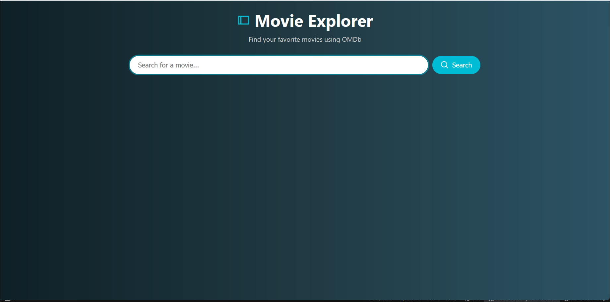
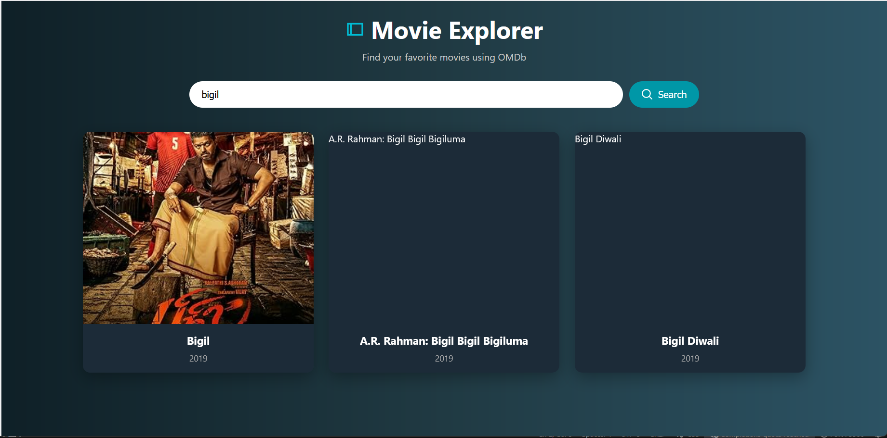
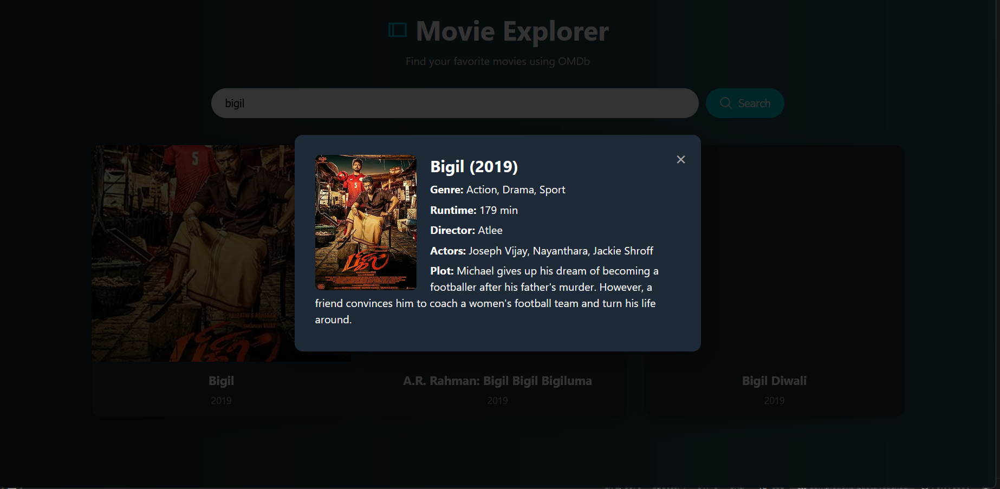

# 🎬 OMDb Movie Search App

A simple web app using the [OMDb API](https://www.omdbapi.com/) that allows users to search for movies by title and view details like poster, release year, and more in a cinematic UI.

---

## 🚀 Features

- 🔍 Search for movies by title
- 🖼️ Display poster, title, and year
- 🎞️ Click to view additional movie info (genre, plot, runtime, etc.)
- 📱 Responsive layout for all devices
- 🌠 Animated cinematic background
- 🎨 Stylish cards with hover effects and SVG icons

---

## 🧪 Technologies Used

- HTML5
- CSS3 (Flexbox, animations)
- JavaScript (Fetch API, DOM manipulation)
- OMDb API

---

## 💻 Screenshots

### 🖼️ Search Interface


### 🎬 Movie Results Grid


### 📋 Movie Details Popup


---

## 🛠️ Setup Instructions

1. Clone this repository:
   ```bash
   git clone https://github.com/your-username/omdb-movie-search.git
